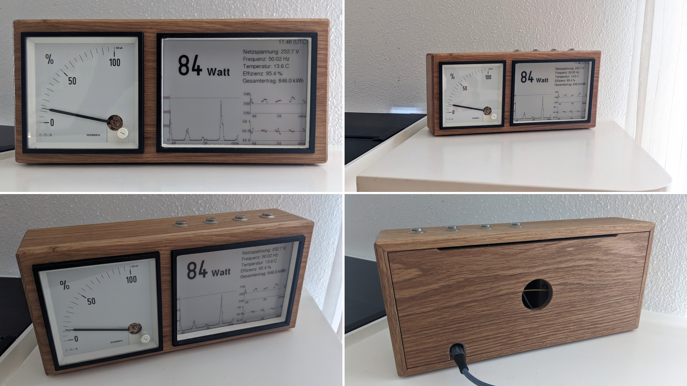

# Smart Home Böxle

The Smart Home Böxle is a pretty little wooden box that combines a classic analogue ammeter with an e-Ink display to visualize home automation data. (‘Böxle’ is German, Swabian to be precise, and means ‘little box’.)

## Parts list

- 8mm solid wood (here oak was used)
- ESP32 Dev Kit C
- 5.83" E-Paper Display Module by Waveshare (648×480&hairsp;px, black/red/white)
- Analog ammeter or voltmeter with size 96x96&hairsp;mm (here a 100&hairsp;µA ammeter by [Gossen](https://g-mw.de/) was used)
- USB-C female socket
- Micro-USB cable
- Pushbutton switches (4 pieces)
- Acrylic glass panel (here a black panel was used)
- White acrylic paint

... and some DuPont cables, PCB spacers, pin strip, heat shrink tube, and similar typical electronic components.

For the black frame around the cutout of the e-paper display, a standard 3D printer was used.

## Build instructions

The box consists of a rectangular body and a front panel. At the back, a removable cover is inserted into the body.

It is best to first cut the cutouts for the ammeter and the e-paper display in the front panel on a router table. Only then saw the front panel to size, with one or two millimeters tolerance on all four sides.

The body is built from four wood strips of the same width with 45° miters. The width of the wood strips is determined primarily by the depth of the ammeter. The lengths of the wood strips are 255mm and 118mm, respectively.

But before gluing the wood strips, drill four holes for the pushbutton switches into the top wood strip. Furthermore, remove a small strip on the upper inside front for the e-paper display since the display's top border is wider than the other borders.

Glue small triangles 9mm from the back into the corners of the body. Furthermore, glue a vertical separator between the space for the ammeter and the space for the e-paper display.

Glue the front panel on the body, remove the protruding wood of the front panel using a flush cutter on a router table. Cut a small chamfer all around the box.

Paint the inner sides of the cutout for the e-paper display with a white acrylic paint.

The e-paper display is delivered with a small ribbon cable and a driver board. Cut a (black) acrylic glass panel that is slightly larger than the display but small enough to fit in the right half of the box. Mount the driver board on the acrylic glass panel, guide the ribbon cable over the edge and attach the display to the other side of the acrylic glass panel with adhesive pads. Slide the acrylic glass panel with the display into the box from the back and place it vertically behind the cutout.

In the photo below, the acrylic glass panel is fixed on the left and right by two other acrylic glass panels which were glued with double-sided adhesive tape.

The wiring of the driver board for SPI is shown below on the left.

After inserting and tightening the four pushbutton switches, mount the ESP32 reversed at the bottom of the frame using PCB spacers. I screwed the spacers through the wood from below. I also drilled a hole from the bottom side to the boot button so that it can be pushed with a thin pen or screwdriver for flashing the ESP32. (Alternatively, you may ground GPIO 0 with a DuPont cable for entering the flashing mode.)

In addition to the ESP32, I mounted a small circuit board with a pin strip for grounding the pushbutton switches, the e-paper display, and the ammeter to the GND pin of the ESP32. The middle image below shows this pin strip.

For power supply and flashing, I cut off a four-wire micro-USB cable and soldered it to a four-contact USB-C socket (see photo below right). The socket is attached using a small wooden block.

Mount/glue a small black frame around the cutout of the e-paper display. An STL file for 3D printing such a frame can is stored at [cad/black_frame_for_e-paper_display.stl](cad/black_frame_for_e-paper_display.stl).

Next, insert the ammeter in the box. I fixed it with some foam stuffed around the ammeter.

The last step is the back cover, which is placed in the body. Drill a finger-sized hole in the center so that it can be easily taken out. I used a hand-held router to additionally drill two holes for the contacts of the ammeter, which protrude a little further. Furthermore, I glued in a small magnet to hold the cover magnetically at a screw in the vertical wood strip between the ammeter and the e-paper display. To avoid any interference, ensure that the screw and the magnet are a few centimeters away from the coil of the ammeter.

The above 2D drawings can be found in scale 1:1 in [cad/2D_drawings_of_front_panel_and_body.pdf](cad/2D_drawings_of_front_panel_and_body.pdf).

## Test scripts

The file [test/analog_out_sinus/analog_out_sinus.ino](test/analog_out_sinus/analog_out_sinus.ino) provides a small test program that outputs a 0.25 Hz sinus between 0 and 3.3 V on GPIO 25. This may be used to test an analog ammeter or voltmeter as depicted below.

  

In the video, a 100&hairsp;µA ammeter is used with a 33&hairsp;kΩ at GPIO 25.
